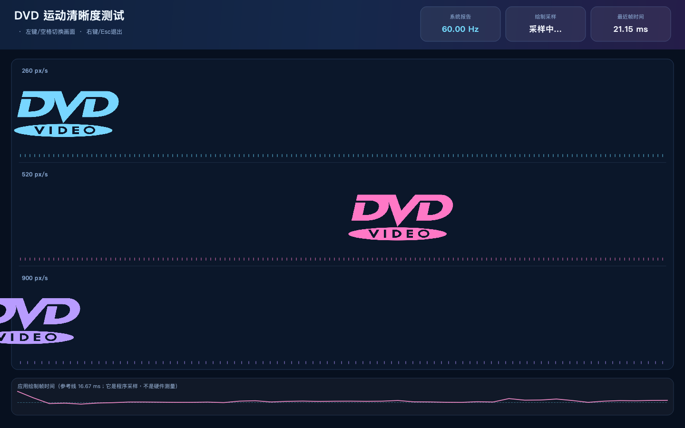

# MoeDiskScreenSaver

<div align="center">
  
  <p><strong>让盘姬陪你看 DVD 撞角落，也陪你观察屏幕跑得够不够顺。</strong></p>
  <p>@本地磁盘姬 作品 · @made by MoeDisk</p>
</div>

MoeDiskScreenSaver 是一个使用 Qt 编写的跨平台 DVD 动画屏幕保护程序，带有可爱的盘姬启动界面和屏幕刷新率观察工具。

## 界面预览

### 盘姬启动界面


### DVD 动画


### 屏幕刷新率观察

| 测试说明 | 运动清晰度与帧时间 |
| --- | --- |
|  |  |

## 功能

- 经典 DVD 标志弹跳动画
- 窗口模式和全屏屏幕保护模式
- Esc 从全屏返回窗口
- 屏幕刷新率、帧时间和运动清晰度观察
- 中文、英文、日文界面
- macOS、Windows 和 Linux 支持

## 环境

- Qt 5 或 Qt 6
- CMake 3.16 或更高版本
- 支持 C++11 的编译器

## macOS 和 Linux 构建

```bash
./build-unix.sh
```

也可以直接使用 CMake：

```bash
cmake -S . -B build-cmake -DCMAKE_PREFIX_PATH=/path/to/Qt
cmake --build build-cmake --config Release
```

macOS 原生屏幕保护插件可以使用下面的命令构建：

```bash
./packaging/macos/build-native-saver.sh
```

## Windows 构建

将 Qt 的 `bin` 目录和 MinGW 的 `bin` 目录加入 `PATH`，然后运行：

```bat
build.bat
```

构建完成后，`release` 目录会同时生成 `MoeDiskScreenSaver.exe` 和 `MoeDiskScreenSaver.scr`。

## 运行参数

- 无参数：打开盘姬启动界面
- `--screensaver`：启动全屏屏幕保护
- `--preview`：打开预览窗口
- `--settings`：打开设置说明

Windows 同时支持屏幕保护程序标准参数 `/s`、`/p` 和 `/c`。

## 支持项目

如果这个小工具让你的桌面更有趣，欢迎自愿投喂盘姬。感谢每一份支持，也请量力而行。

<div align="center">
  
  <p>微信扫一扫 · 赞赏支持</p>
</div>

## 作者

- @本地磁盘姬 作品
- @made by MoeDisk
